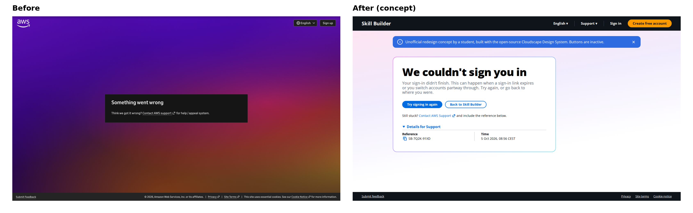
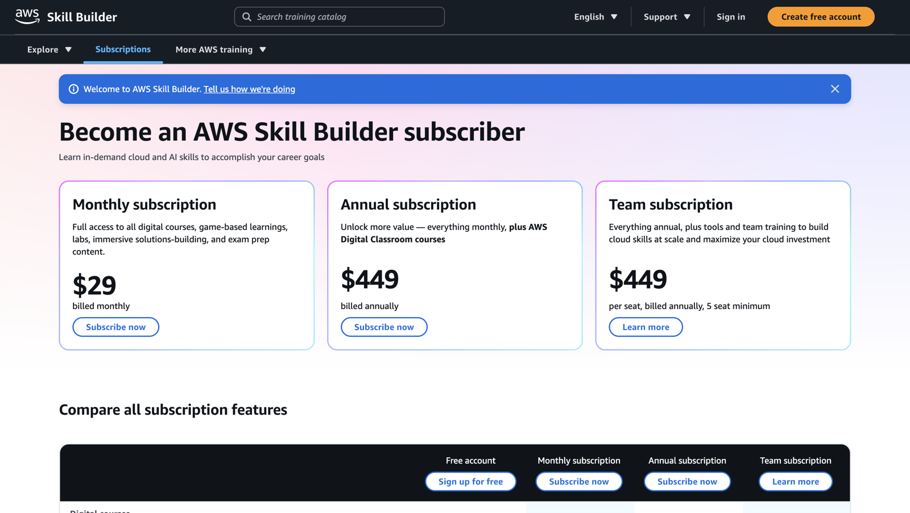
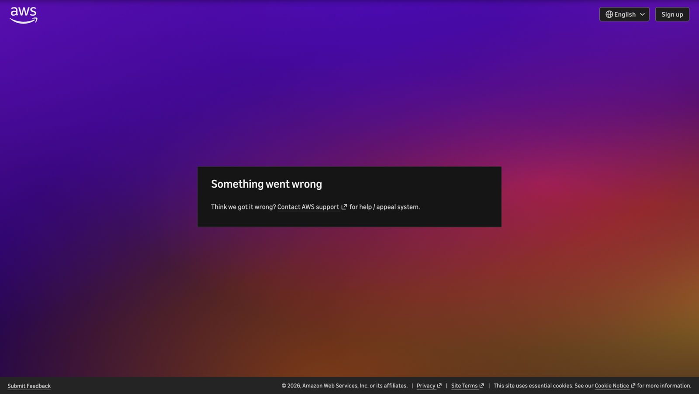

# Skill Builder sign-in error page: redesign concept

> **Unofficial.** Independent student project, not affiliated with or endorsed by Amazon Web Services. Built with the open-source [Cloudscape Design System](https://cloudscape.design). Buttons are inactive.

**Live concept:** https://akochenko.github.io/skillbuilder-error-page-redesign/



## The problem

I subscribed on Skill Builder (light, Cloudscape-style page with a dark top bar), then got sent to a sign-in error page with a completely different look: a purple-to-orange gradient, a black box, and a different header. It felt like leaving the site, and in a sign-in flow, a sudden change of look is exactly what makes people wonder whether a page is legitimate.

| Skill Builder (before redirect) | Error page (after redirect) |
|---|---|
|  |  |

## What changed

| | Before | After |
|---|---|---|
| Look | Separate gradient theme, black box | Same as Skill Builder: dark top bar, soft pink-lavender wash, gradient-bordered card, pill buttons |
| Header | Logo, language, Sign up | Same header as Skill Builder, so the user stays in one product |
| Message | "Something went wrong" | Says what happened and the likely cause |
| Wording | "for help / appeal system" reads like an account ban | Neutral: try again, go back, or contact Support |
| Next steps | One Support link | **Try signing in again**, **Back to Skill Builder**, Support link |
| Support | Nothing to quote | Copyable reference and timestamp for faster tickets |
| Mobile | Not checked | Responsive down to phone width |

## Run locally

```bash
npm install
npm run dev     # http://localhost:5173
npm run build   # static build in dist/
```

## Notes

React 18, Vite, Cloudscape (Apache-2.0). The reference ID and timestamp are example values. Screenshots are my own, with the browser bar and URL cropped out.
